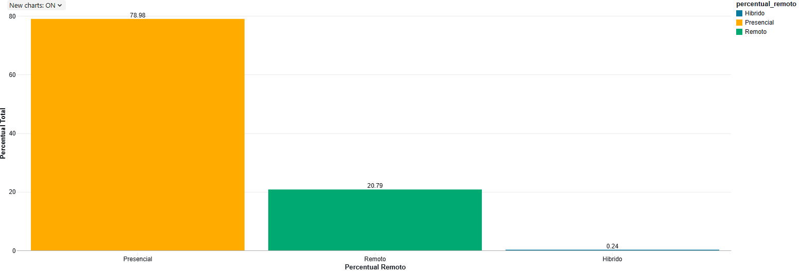

# 𝗣𝗶𝗽𝗲𝗹𝗶𝗻𝗲 𝗱𝗲 𝗗𝗮𝗱𝗼𝘀 𝗰𝗼𝗺 𝗔𝘇𝘂𝗿𝗲 𝗗𝗮𝘁𝗮𝗯𝗿𝗶𝗰𝗸𝘀 - 𝗣𝗿𝗼𝗳𝗶𝘀𝘀𝗶𝗼𝗻𝗮𝗶𝘀 𝗧𝗜

## 1. 📌 📌 Problema

Os dados brutos de salários de profissionais de TI apresentam informações em diferentes formatos e códigos, dificultando o consumo analítico e a interpretação dos dados. Era necessário padronizar essas informações para disponibilizá-las de forma adequada à análise e responder perguntas de negócio.
Entre os tratamentos realizados estão a padronização dos nomes das colunas para o contexto de negócio e a transformação de categorias codificadas, como **EN → Júnior, MI → Pleno, SE → Sênior e EX → Executivo.**

## 2.💡 Solução
Para solucionar esse problema, foi desenvolvido um pipeline de dados no Azure Databricks utilizando Arquitetura Medallion, organizando o processamento nas camadas RAW, Bronze, Silver e Gold. Os dados foram tratados e padronizados ao longo do pipeline e disponibilizados na camada Gold para consumo analítico e resposta às perguntas de negócio.

---

## 3. 📊 Data Profiling

Durante o **Data Profiling**, foram identificadas as principais características da fonte:

- 133.349 registros
- 11 colunas
- 10 registros com `work_year` nulo
- Identificação dos tipos de dados
- Identificação das variáveis categóricas e seus respectivos códigos

---

## 4. 🏗️ Arquitetura Medallion, Infraestrutura e Segurança

O armazenamento físico dos dados é realizado no ADLS Gen2, enquanto o Unity Catalog fornece a organização lógica, governança e controle de acesso às tabelas.

---

## 5. 🛠️ Transformações

### Tratamento de valores nulos

Durante o processamento da camada Silver, foram removidos os **10 registros que apresentavam valor nulo na coluna `work_year`**.

Com isso, a base passou de **133.349 para 133.339 registros**.

### Padronização das colunas

Após o tratamento dos valores nulos, as colunas foram padronizadas para o contexto de negócio:

| Coluna original | Coluna padronizada |
|---|---|
| `work_year` | `ano_pagamento` |
| `experience_level` | `nivel_experiencia` |
| `employment_type` | `tipo_contrato` |
| `job_title` | `cargo` |
| `salary` | `salario_bruto` |
| `salary_currency` | `moeda_pagamento` |
| `salary_in_usd` | `salario_usd` |
| `employee_residence` | `pais_residencia` |
| `remote_ratio` | `percentual_remoto` |
| `company_location` | `pais_empresa` |
| `company_size` | `tamanho_empresa` |

### Transformação dos valores categóricos

**Coluna `nivel_experiencia`:**

- `EN` → Júnior
- `MI` → Pleno
- `SE` → Sênior
- `EX` → Executivo

**Coluna `tipo_contrato`:**

- `FT` → Tempo Integral
- `PT` → Parcial
- `CT` → Contrato
- `FL` → Freelancer

**Coluna `percentual_remoto`:**

- `0` → Presencial
- `50` → Híbrido
- `100` → Remoto

**Coluna `tamanho_empresa`:**

- `S` → Pequena
- `M` → Média
- `L` → Grande

---

## 6. 📈 Análises de Negócio

### 1️⃣ Qual o nível de experiência mais comum na base?

### 2️⃣ Existe relação entre trabalho remoto e salário?

### 3️⃣ Qual o percentual de profissionais remotos vs presenciais?

### 4️⃣ Quais países concentram mais profissionais de TI?

### 5️⃣ Qual o impacto da senioridade no trabalho remoto?

As consultas SQL utilizadas para responder às cinco perguntas estão disponíveis no notebook_analytics do diretório do projeto.

---

## 7. 🧱 Tecnologias utilizadas

- Microsoft Azure
- Azure Databricks
- ADLS Gen2
- Delta Lake
- Unity Catalog
- Apache Spark
- SQL
- Azure RBAC
- Managed Identity

---

## 8. 👤 Autor

**Genivon Silva**  
**Engenheiro de Dados**

- 💻 GitHub: [Genivon Silva](https://github.com/jhenivon)
- 🔗 LinkedIn: [https://www.linkedin.com/in/genivon-silva-69bb9b9b/](https://www.linkedin.com/in/genivon-silva-69bb9b9b/)

